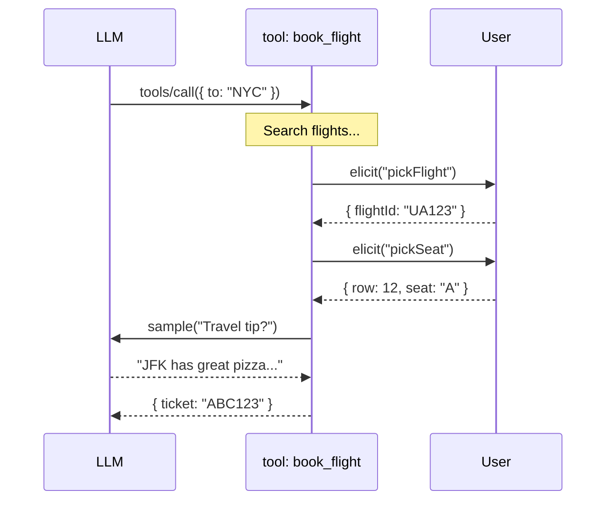

# MCP-Native

## Tools That Live Inside Your App

<div class="pt-12">
  <span class="px-2 py-1 rounded cursor-pointer bg-gray-100">
    Sweatpants Framework
  </span>
</div>

<div class="abs-br m-6 flex gap-2 text-sm opacity-50">
  comfy | powerful | btw i use arch
</div>

---

# Isomorphic Tools

Tools with server logic AND client UI in one definition.

````md magic-move
```ts
const pickCard = createIsomorphicTool('pick_card')
  .description('Draw cards and let the user pick one')
  .parameters(z.object({ count: z.number() }))
  .handoff({
    *before(params) {
      const cards = drawCards(params.count)
      return { cards }
    },
    *client(handoff, ctx) {
      const picked = yield* ctx.render(CardPicker, { 
        cards: handoff.cards 
      })
      return picked
    },
    *after(handoff, picked) {
      return `User picked the ${picked.card}`
    },
  })
```
```ts
// Step 1: Server draws the cards
.handoff({
  *before(params) {
    const cards = drawCards(params.count)
    return { cards }  // ──────────────────────┐
  },                                        // │
  *client(handoff, ctx) {                   // │
    //                                         ▼
  },
  *after(handoff, picked) {
    //
  },
})
```
```ts
// Step 2: Cards flow to React, user picks
.handoff({
  *before(params) {
    const cards = drawCards(params.count)
    return { cards }  // ──────────────────────┐
  },                                        // │
  *client(handoff, ctx) {                   // ▼
    const picked = yield* ctx.render(CardPicker, { 
      cards: handoff.cards   // cards arrive here!
    })
    return picked  // ─────────────────────────┐
  },                                        // │
  *after(handoff, picked) {                 // │
    //                                         ▼
  },
})
```
```ts
// Step 3: Pick flows to after(), result to LLM
.handoff({
  *before(params) {
    const cards = drawCards(params.count)
    return { cards }
  },
  *client(handoff, ctx) {
    const picked = yield* ctx.render(CardPicker, { 
      cards: handoff.cards
    })
    return picked  // { card: '7♠' } ──────────┐
  },                                        // │
  *after(handoff, picked) {                 // ▼
    return `User picked the ${picked.card}`  // → LLM
  },
})
```
````

---

# Let's Build book_flight

User wants to book a flight. We need to:

1. Search for flights
2. Let user pick a flight (with nice UI)
3. Let user pick a seat (with seat map)
4. Get a travel tip from the LLM
5. Return confirmation

<v-click>

<div class="mt-6 text-xl">

Easy, right? Just make some isomorphic tools...

</div>

</v-click>

---

# Attempt 1: Multiple Tools

```typescript
const searchFlights = createIsomorphicTool('search_flights')
  .handoff({ /* returns list of flights */ })

const pickFlight = createIsomorphicTool('pick_flight')
  .handoff({ /* renders FlightPicker, user selects */ })

const pickSeat = createIsomorphicTool('pick_seat')
  .handoff({ /* renders SeatMap, user selects */ })

const bookFlight = createIsomorphicTool('book_flight')
  .handoff({ /* finalizes booking */ })
```

<v-click>

<div class="mt-6 p-4 bg-amber-50 rounded-lg">

**Problem:** Who calls these tools? In what order?

</div>

</v-click>

<v-click>

<div class="mt-4 p-4 bg-red-50 rounded-lg">

**The LLM decides.** And it's non-deterministic.

</div>

</v-click>

---
layout: center
class: text-center
---

## The LLM controls the flow

<div class="text-xl mt-8 text-gray-600">

<v-clicks>

It might call `pick_seat` before `pick_flight`

It might skip `search_flights` entirely

It might call `book_flight` without user confirmation

It might just... not call the tools at all

</v-clicks>

</div>

---

# Attempt 2: One Big Tool?

```typescript
const bookFlight = createIsomorphicTool('book_flight')
  .handoff({
    *client(handoff, ctx) {
      // Step 1: Pick flight
      const flight = yield* ctx.render(FlightPicker, { flights: handoff.flights })
      
      // Step 2: Pick seat
      const seat = yield* ctx.render(SeatPicker, { flight })
      
      // Step 3: Get travel tip... wait, how?
      const tip = yield* ???  // We're on the CLIENT
      
      return { flight, seat, tip }
    },
  })
```

<v-click>

<div class="mt-4 p-4 bg-red-50 rounded-lg">

**Problem:** The client phase can render UI, but it can't call the LLM.

That would require a round-trip to the server... mid-tool-execution.

</div>

</v-click>

---
layout: center
class: text-center
---

# We need something to coordinate

<v-clicks>

<div class="text-2xl mt-8">

A way for the **tool** to control the flow

Not the LLM

</div>

<div class="text-2xl mt-4">

A way to **suspend** mid-execution

Ask the user something, wait, resume

</div>

<div class="text-2xl mt-4">

A way to **call the LLM** from inside a tool

Not just be called BY the LLM

</div>

</v-clicks>

---
layout: two-cols
---

# Enter MCP

MCP is **bidirectional**. During a tool call, the server can request things FROM the client.

**The Key Primitives:**

- `tools/call` - LLM calls a tool
- `elicitation/create` - Tool asks user for input
- `sampling/createMessage` - Tool asks for LLM completion

<v-click>

<div class="mt-4 p-3 bg-blue-50 rounded-lg text-sm">

The **tool** controls the flow. It can suspend, ask questions, call the LLM, then resume.

</div>

</v-click>

::right::



---
layout: center
class: text-center
---

## But MCP tools run as **external processes**

<div class="text-xl mt-8 text-gray-600">

<v-clicks>

Sampling goes to... where exactly?

Elicitation gives you... a flat JSON form

No React. No rich UI. No shared state.

</v-clicks>

</div>

---

# MCP Elicitation: The Spec

From the MCP spec (2025-11-25):

> "Form mode elicitation schemas are limited to **flat objects with primitive properties only**."

```typescript
// This is valid
{ name: z.string(), age: z.number(), agree: z.boolean() }

// This is NOT valid
{ user: z.object({ name: z.string() }) }  // nested object
{ tags: z.array(z.string()) }              // array
```

<v-click>

<div class="mt-6 p-4 bg-amber-50 rounded-lg">

**Translation:** Text inputs, numbers, checkboxes, dropdowns.

Want a flight picker with airline logos? A seat map? Good luck.

</div>

</v-click>

---

# What Others Are Proposing

| Protocol | Origin | Focus | UI Story |
|----------|--------|-------|----------|
| **AG-UI** | CopilotKit | Agent<->User protocol | Event-based, supports UI specs |
| **A2UI** | Google | Declarative UI spec | JSONL-based, streaming |
| **MCP-UI** | MS + Shopify | MCP extension | iframe-based rendering |
| **Open-JSON-UI** | OpenAI | UI schema | JSON widget definitions |

<v-click>

<div class="mt-6 p-4 bg-blue-50 rounded-lg">

**These are all good ideas.** But they share an assumption:

MCP tools are external. You ship UI specs across process boundaries.

</div>

</v-click>

---
layout: center
class: text-center
---

# What if the tool could just...

<v-click>

<div class="text-6xl font-bold text-blue-600 mt-4">
run inside your app?
</div>

</v-click>

---

# MCP-Native Architecture

```
SERVER (chat-engine)                    CLIENT (React)
                                        
MCP Tool Generator                      
  |                                     
  +-- ctx.sample() --> provider.stream()
  |   (stays server-side!)              
  |                                     
  +-- ctx.elicit('pickFlight') ---------> ElicitRequest
  |   (generator suspends)                    |
  |                                           v
  |                                      onElicit handler
  |                                           |
  |                                           +-- ctx.render(FlightList)
  |                                           |   (React renders!)
  |                                           |
  |   <--------------------------------- ElicitResult
  |   (generator resumes)               
  |                                     
  v                                     
Tool completes                          
```

---

# Define the Tool, Create the Plugin

````md magic-move
```ts
// Step 1: Define the MCP tool with elicit keys
const bookFlightTool = createMcpTool('book_flight')
  .description('Book a flight for the user')
  .parameters(z.object({
    from: z.string(),
    destination: z.string(),
  }))
  .elicits({
    pickFlight: z.object({ flightId: z.string() }),
    pickSeat: z.object({ row: z.number(), seat: z.string() }),
  })
  .execute(function* (params, ctx) {
    const flights = yield* searchFlights(params.from, params.destination)
    
    const flight = yield* ctx.elicit('pickFlight', { flights })
    const seat = yield* ctx.elicit('pickSeat', { seatMap: getSeatMap(flight) })
    const tip = yield* ctx.sample({ prompt: `Travel tip for ${params.destination}` })
    
    return { ticketNumber: generateTicket(), flight, seat, tip }
  })
```
```tsx
// Step 2: Plugin renders REACT COMPONENTS for each elicit
const bookFlightPlugin = makePlugin(bookFlightTool)
  .onElicit({
    pickFlight: function* (req, ctx) {
      //         ┌─────────────────────────────────┐
      //         │  <FlightList flights={[...]} /> │  ← Your React component!
      //         └─────────────────────────────────┘
      const result = yield* ctx.render(FlightList, { flights: req.flights })
      return { action: 'accept', content: result }
    },
    pickSeat: function* (req, ctx) {
      //         ┌─────────────────────────────────┐
      //         │  <SeatPicker seatMap={[...]} /> │  ← Rich UI, not a form!
      //         └─────────────────────────────────┘
      const result = yield* ctx.render(SeatPicker, { seatMap: req.seatMap })
      return { action: 'accept', content: result }
    },
  })
  .build()
```
```ts
// The tool flows into makePlugin()
const bookFlightTool = createMcpTool('book_flight')
  .elicits({
    pickFlight: z.object({ flightId: z.string() }),  // ─┐
    pickSeat: z.object({ row: z.number(), seat: z.string() }),  // ─┤
  })                                                 //  │
  .execute(...)                                      //  │
                                                     //  │
const bookFlightPlugin = makePlugin(bookFlightTool)  //  │
  .onElicit({                                        //  │
    pickFlight: function* (req, ctx) { ... },  // <────┘ TypeScript enforces
    pickSeat: function* (req, ctx) { ... },    // <────┘ matching handlers!
  })
  .build()
```
````

---

# Step 3: The React Components

```tsx {all|1-4|6-17|all}
interface FlightListProps extends RenderableProps<{ flightId: string }> {
  flights: Flight[]
  message: string
}

function FlightList({ flights, message, onRespond, disabled }: FlightListProps) {
  return (
    <div className="flight-list">
      <h3>{message}</h3>
      {flights.map(flight => (
        <FlightCard 
          key={flight.id} 
          flight={flight}
          onSelect={() => onRespond({ flightId: flight.id })}
        />
      ))}
    </div>
  )
}
```

---

# Step 4: Use It

```tsx
import { useChat } from '@sweatpants/framework/react'
import { bookFlightPlugin } from './tools/book-flight'

function ChatApp() {
  const { messages, sendMessage, pendingEmissions } = useChat({
    plugins: [bookFlightPlugin],
  })

  return (
    <div>
      <MessageList messages={messages} />
      {pendingEmissions.map(e => <e.Component key={e.id} {...e.props} />)}
      <ChatInput onSend={sendMessage} />
    </div>
  )
}
```

---

# Want a Real MCP Server Too?

```typescript
import { createMcpServer } from '@sweatpants/framework/mcp'
import { bookFlightTool } from './tools'

const server = createMcpServer({
  name: 'my-travel-agent',
  version: '1.0.0',
  tools: [bookFlightTool],
})

server.listen()  // stdio for Claude Desktop
```

<v-click>

<div class="mt-6 p-4 bg-purple-50 rounded-lg">

Same tool definition. Rich React UI in your app, flat forms as MCP server.

</div>

</v-click>

---

# Side-by-Side

| | Isomorphic Tools | Traditional MCP | MCP-Native |
|--|-----------------|-----------------|------------|
| Flow control | LLM decides | Tool decides | Tool decides |
| Mid-tool LLM calls | No | Yes | Yes |
| UI | React | Flat forms | **React** |
| Where it runs | Your app | External | **Your app** |
| Sampling provider | N/A | Tool's own | **Yours** |

---
layout: two-cols
---

# What This Enables

<v-clicks>

- **Rich interactive workflows**
  - Flight picker with airline logos
  - Seat maps with availability
  - Multi-step wizards

- **Multi-model orchestration**
  - Tool calls your main provider
  - No separate LLM config

- **True isomorphism**
  - Same tool runs in chat app
  - Same tool runs as MCP server

</v-clicks>

::right::

<v-click>

```
Your App
├── Chat UI (React)
│   └── Plugin renders FlightList
│
├── Chat Engine (Server)
│   └── Tool calls ctx.sample()
│       └── Uses YOUR provider
│
└── MCP Server (Optional)
    └── Same tool, flat forms
```

</v-click>

---
layout: center
---

# Key Takeaways

<v-clicks>

1. **Isomorphic tools** are great, but the LLM controls the flow

2. **MCP** lets the tool control flow with elicit/sample

3. **External MCP servers** limit UI to flat forms

4. **MCP-Native**: tools run inside, React for UI, your provider for sampling

5. **Same tool works both ways** - in-app with rich UI, or as MCP server

</v-clicks>

---
layout: center
class: text-center
---

# Status

<div class="grid grid-cols-2 gap-8 mt-8 text-left">

<div>

### Working Now
- `createMcpTool()` builder
- `makePlugin()` with typed handlers
- `ctx.render()` / `ctx.elicit()`
- Session management
- `useChat` integration

</div>

<div>

### Coming Soon
- Durable Objects backend
- Multi-elicit flows (E2E tested)
- MCP server export
- More examples

</div>

</div>

---
layout: center
class: text-center
---

# Questions?

<div class="mt-8 text-gray-500">

```
apps/yo-chat/src/tools/     # Example tools
packages/framework/         # The framework
docs/mcp-plugin-bridge-*    # Design docs
```

</div>

<div class="mt-12 opacity-50 text-sm">

btw i use arch

</div>
