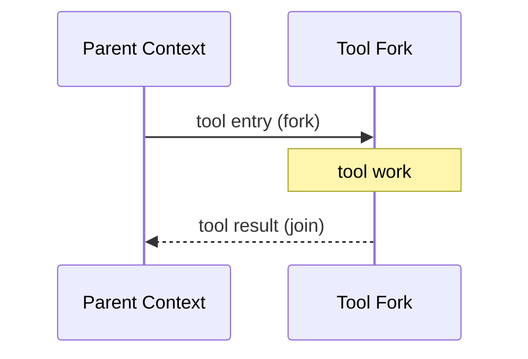
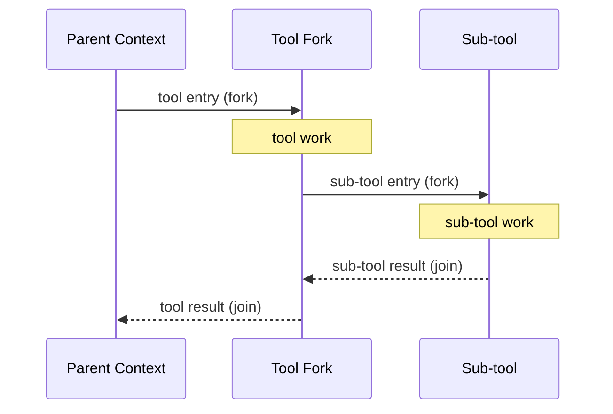
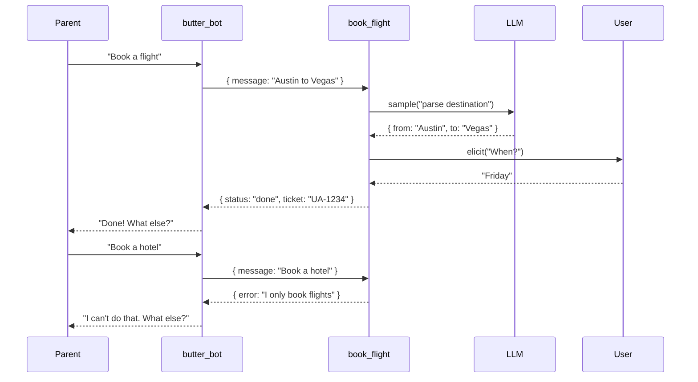
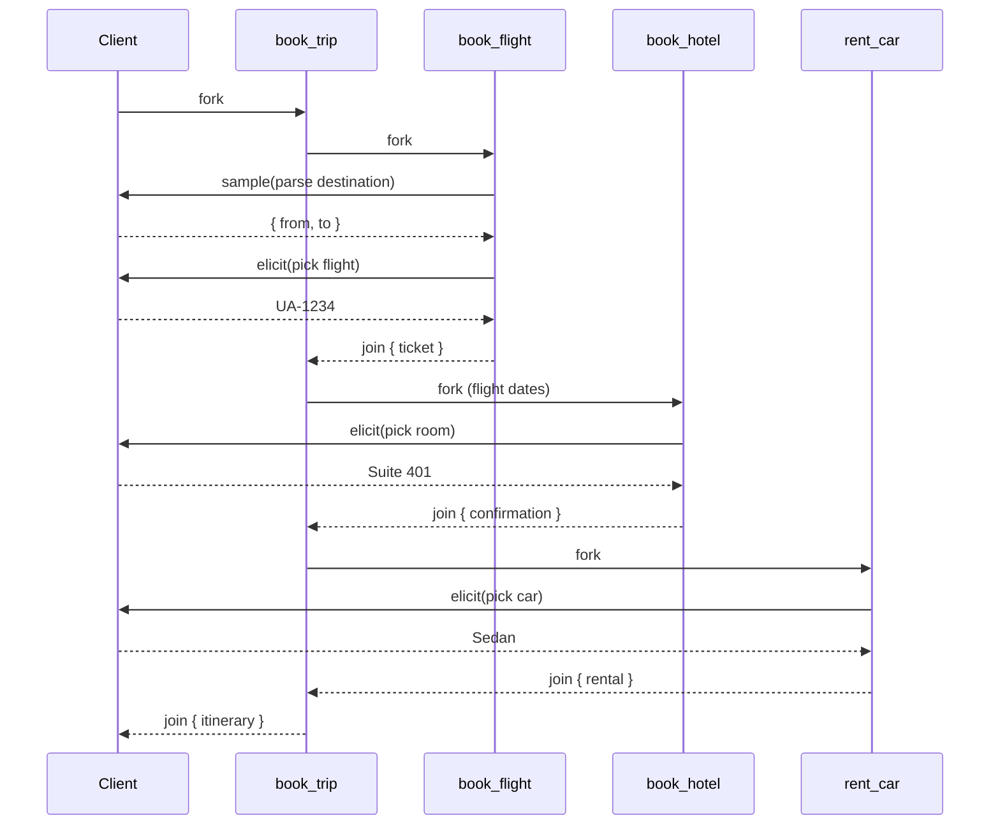

# Context is a Fork-Join Problem

## What MCP taught us about deterministic flow

  
    Sweatpants Framework
  

  architecture | DX | adoption

---

# The Problem We All Hit

<v-clicks>

**Context rot**: the model forgets, repeats, or hallucinates

**Flow drift**: the model decides what to do next

**Hidden coupling**: tools mutate context implicitly

**Unbounded growth**: token budgets explode

</v-clicks>

---

# The Mental Model

Context is a flame chart of forks and joins.

---

# Forks Can Fork

Each fork must join back to its parent.

---

# Micro-Loops

"What is my purpose?" "You pass butter."

<v-click>

Elicits fork right to user. Samples fork right to LLM. All join back.

</v-click>

---

## Composite ButterBots

`book_trip` orchestrates flight, hotel, car.

But who owns the LLM?

Sub-tools don't call the LLM directly.

They ask the **client** to sample.

---

# Why Client Affinity Matters

The client owns:
- The **user connection** (for elicitations)
- The **LLM API key** (for sampling)

<v-clicks>

If sub-tools owned the LLM relationship:
- They'd need their own API keys
- Or the parent "loans" credentials down the tree
- Cost/billing fragments across agents
- Auth becomes a nightmare

</v-clicks>

<v-click>

**The rule:** Depth doesn't change the client anchor.

</v-click>

---

# MCP Gives Us the Primitives

MCP already encodes fork/join.

- `tools/call` = fork into tool
- `elicitation/create` = fork into user
- `sampling/createMessage` = fork into LLM
- `tool_result` = join back to parent

---

# The Business Takeaway

## What is a ButterBot?

A micro-chat with one purpose.

- Controls a loop around a single tool
- Passes messages, props, and history
- Signals success or failure to the parent
- "What else can I help with?"

<v-click>

ButterBot is shared vocabulary:

| Engineering | Design | Business |
|-------------|--------|----------|
| fork-join flow | scoped interaction | predictable cost |

</v-click>

---

# Closing

Context is not a blob. It's a concurrency problem.

<v-click>

MCP gives us the fork/join primitives. Sweatpants shows the discipline.

</v-click>

context is a fork-join problem

