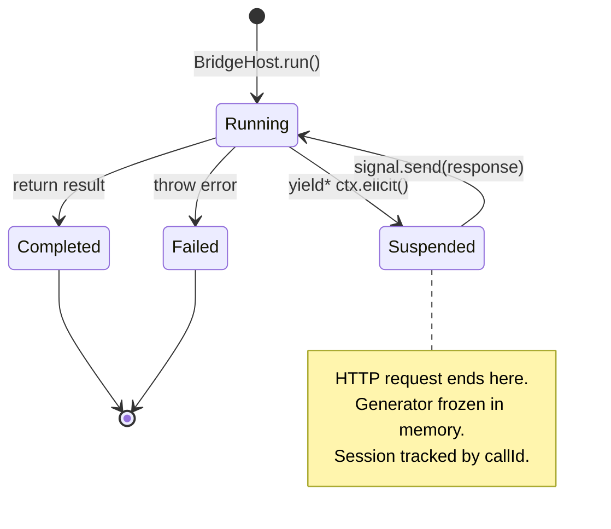
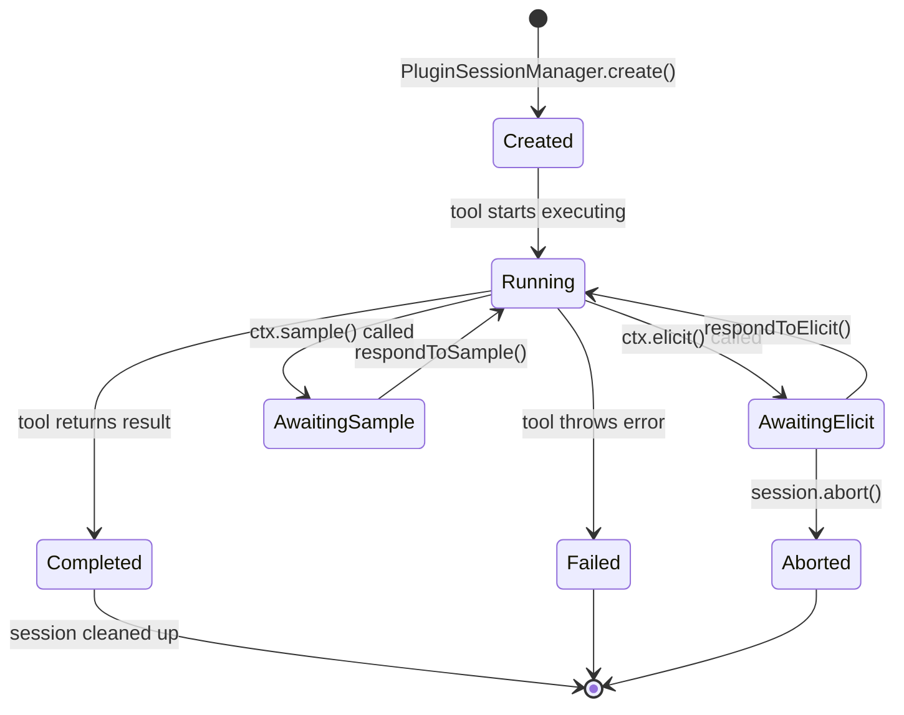
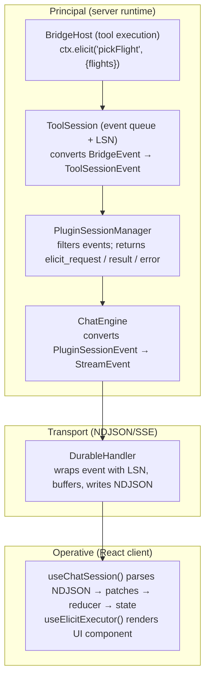
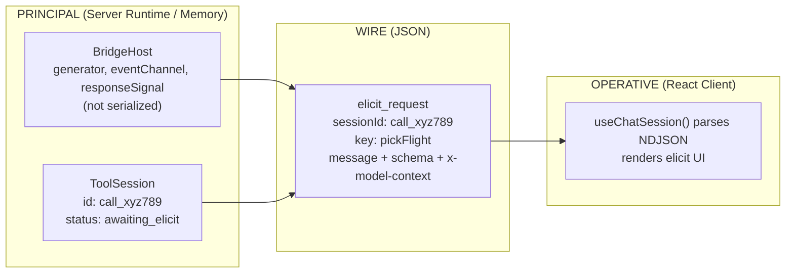
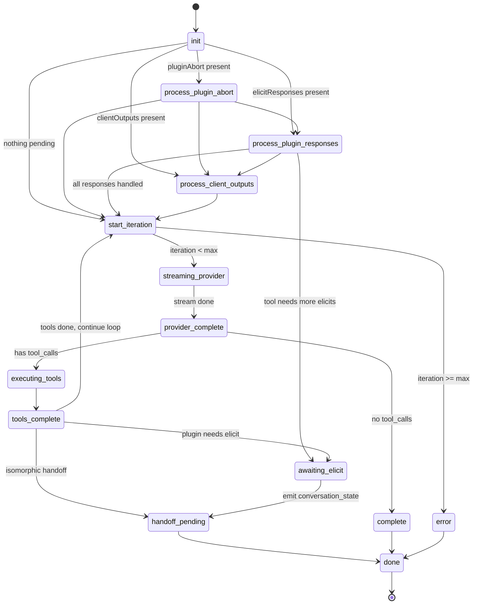
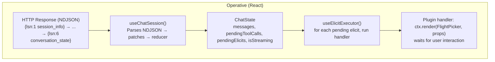
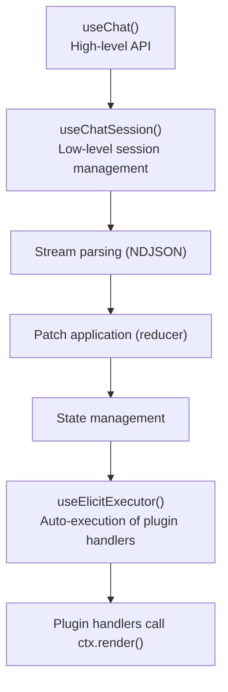
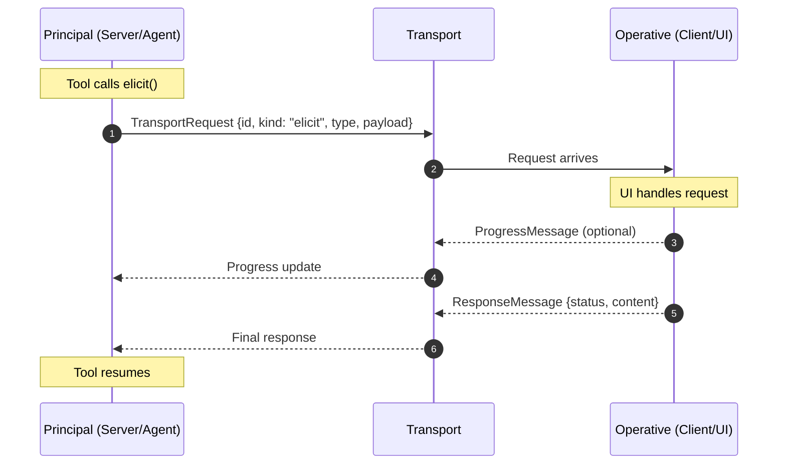

# Sweatpants Framework Internals

> A contributor's guide to the architecture that makes multi-turn agentic tools possible.

## Table of Contents

- [The Problem We're Solving](#the-problem-were-solving)
- [Architecture Overview](#architecture-overview)
- [End-to-End Flow: Book a Flight](#end-to-end-flow-book-a-flight)
- [Chapter 1: The Execution Model](#chapter-1-the-execution-model)
- [Chapter 2: Session Management](#chapter-2-session-management)
- [Chapter 3: The Event System](#chapter-3-the-event-system)
- [Chapter 4: Serialization Boundaries](#chapter-4-serialization-boundaries)
- [Chapter 5: The Chat Engine](#chapter-5-the-chat-engine)
- [Chapter 6: The React Bridge](#chapter-6-the-react-bridge)
- [Chapter 7: The Core Package](#chapter-7-the-core-package)
- [Chapter 8: Extension Points](#chapter-8-extension-points)

---

## The Problem We're Solving

Traditional tool execution is simple: `call → execute → return`. Done in one HTTP request.

**Multi-turn agentic tools** are different. They need to:

| Capability | Traditional Tool | Multi-Turn Agentic Tool |
|------------|------------------|------------------------|
| LLM Interaction | None | Multiple back-and-forth exchanges |
| User Interaction | None | Multiple UI prompts and responses |
| State Lifetime | Single request | Days (user might respond hours later) |
| HTTP Requests | 1 | Many (one per interaction) |
| Concurrency | N/A | Multiple tools in flight |

This is **hard**. The framework essentially builds:

- A **process scheduler** (session management)
- A **checkpoint/restore system** (generator suspension)
- A **message bus** (events across boundaries)
- A **serialization layer** (state that travels over HTTP)

---

## Architecture Overview

The Sweatpants system is split into two packages:

```
┌─────────────────────────────────────────────────────────────────────────────┐
│                           @sweatpants/core                                   │
│                                                                              │
│  Transport-agnostic primitives for building agentic tools:                   │
│  • createTool() - Define tools with Zod schemas                             │
│  • createAgent() - Group tools with shared config                            │
│  • elicit/notify/sample - Built-in operations                               │
│  • Transport layer - Principal/Operative communication                       │
│                                                                              │
│  Location: packages/core/                                                    │
└─────────────────────────────────────┬───────────────────────────────────────┘
                                      │ imports
                                      ▼
┌─────────────────────────────────────────────────────────────────────────────┐
│                         @sweatpants/framework                                │
│                                                                              │
│  Full-stack framework for multi-turn agentic chat:                           │
│  • Chat Engine - State machine orchestrating LLM + tools                     │
│  • Session Management - Tracking suspended tools across requests             │
│  • Durable Streams - LSN-based event replay                                  │
│  • React Bridge - Client-side hooks and plugins                              │
│  • Core Adapter - Bridges core tools to framework isomorphic tools           │
│                                                                              │
│  Location: packages/framework/                                               │
└─────────────────────────────────────────────────────────────────────────────┘
```

### Two Ways to Build Tools

| Approach | Package | Best For | Suspension |
|----------|---------|----------|------------|
| **Core Tools** | `@sweatpants/core` | Simple tools, type-safe APIs, reusable across contexts | Via Transport |
| **MCP/Plugin Tools** | `@sweatpants/framework` | Complex multi-turn UI, deep React integration | Via Signals |

Core tools can be **automatically adapted** to work in the framework:

```typescript
// Core tool defined in packages/core
const SearchFlights = createTool({
  name: 'search_flights',
  input: z.object({ destination: z.string() }),
  output: z.object({ flights: z.array(FlightSchema) }),
  impl: function* ({ destination }) {
    yield* notify({ message: `Searching for flights to ${destination}...` })
    const flights = yield* searchApi(destination)
    return { flights }
  },
})

// Used in framework - automatically adapted
import { createIsomorphicToolRegistry } from '@sweatpants/framework'

const registry = createIsomorphicToolRegistry([
  SearchFlights,  // Core tool - auto-adapted
  drawCardTool,   // Framework isomorphic tool - used as-is
])
```

**See:** [Chapter 7: The Core Package](#chapter-7-the-core-package) for full details.

---

## End-to-End Flow: Book a Flight

Before diving into components, let's trace a complete `book_flight` tool execution:

```mermaid
sequenceDiagram
    autonumber
    participant Principal
    participant Transport
    participant Operative
    participant User
    participant LLM

    rect rgb(40, 40, 60)
        Note over Principal,Operative: Session bootstrap (Principal-driven)
        Principal->>Transport: elicit { type: "prompt", message: "What can I help you with?" }
        Transport->>Operative: request { id: "p1", kind: "elicit", type: "prompt", payload }
        Operative->>Operative: render chat input (agent-specific purpose)
        User->>Operative: "Book me a flight to Tokyo"
        Operative->>Transport: response { id: "p1", action: "accept", content: "Book me a flight to Tokyo" }
        Transport->>Principal: response delivered
    end

    Principal->>LLM: sample("interpret user request")
    LLM-->>Principal: tool_call: book_flight

    rect rgb(40, 40, 80)
        Note over Principal,LLM: Tool Execution Begins (Principal)

        Note over Principal,Operative: Elicit (Location Lookup)
        Principal->>Transport: elicit { id: "loc-1", type: "location", payload: { accuracy: "high" } }
        Transport->>Operative: request { id: "loc-1", kind: "elicit", type: "location", payload }
        Operative->>Operative: request permission + acquire GPS
        Operative->>Transport: progress { id: "loc-1", data: { status: "requesting-permission" } }
        Transport-->>Principal: progress delivered
        Operative->>Transport: progress { id: "loc-1", data: { status: "acquiring" } }
        Transport-->>Principal: progress delivered
        Note over Principal,Operative: Principal SUSPENDED (blocking)
        User->>Operative: grants permission
        Operative->>Transport: response { id: "loc-1", action: "accept", content: { lat, lng } }
        Transport->>Principal: response delivered

        Principal->>LLM: ctx.sample("Find flights...")
        LLM-->>Principal: "Found 3 flights: ..."
    end

    rect rgb(80, 40, 40)
        Note over Principal,Operative: Elicit #1 (Pick Flight)
        Principal->>Transport: elicit request { type: "pickFlight", flights: [...] }
        Transport->>Operative: request { id: "e1", kind: "elicit", type: "pickFlight", payload }
        Operative->>Operative: render FlightPicker
        Operative->>Transport: progress { id: "e1", status: "rendering" }
        Transport-->>Principal: progress delivered
    end

    Note over Principal,Operative: Principal SUSPENDED (waiting for response)

    User->>Operative: clicks "Flight JL-401"
    Operative->>Transport: response { id: "e1", action: "accept", content: { flightId: "JL-401" } }
    Transport->>Principal: response delivered

    rect rgb(80, 40, 40)
        Note over Principal,Operative: Elicit #2 (Pick Seat)
        Principal->>Transport: elicit request { type: "pickSeat", seatMap: [...] }
        Transport->>Operative: request { id: "e2", kind: "elicit", type: "pickSeat", payload }
        Operative->>Operative: render SeatPicker
    end

    Note over Principal,Operative: Principal SUSPENDED again

    User->>Operative: clicks seat "12A"
    Operative->>Transport: response { id: "e2", action: "accept", content: { seat: "12A" } }
    Transport->>Principal: response delivered

    rect rgb(40, 40, 80)
        Note over Principal,LLM: Final Processing
        Principal->>Principal: complete booking logic
        Principal->>LLM: sample("Summarize booking confirmation")
        LLM-->>Principal: "Your flight is booked!"
    end

    rect rgb(40, 40, 60)
        Note over Principal,Operative: Close the loop (Principal-driven)
        Principal->>Transport: elicit { type: "prompt", message: "Can I help you with anything else?" }
        Transport->>Operative: request { id: "p2", kind: "elicit", type: "prompt", payload }
        Operative->>Operative: render chat input
        User->>Operative: "No, thanks"
        Operative->>Transport: response { id: "p2", action: "decline" }
        Transport->>Principal: response delivered
    end

    Principal->>Transport: event { type: "complete", confirmation: "ABC123" }
    Transport->>Operative: event { type: "complete" }
    Operative->>User: shows confirmation
```



**Key insight**: The tool generator runs across multiple HTTP requests, suspending and resuming at each `ctx.elicit()` call.

---

## Chapter 1: The Execution Model

*"How do you run code that needs to pause for days?"*

### The Problem

When `book_flight` calls `ctx.elicit('pickFlight')`, the user might respond in:
- 5 milliseconds (fast clicker)
- 5 minutes (comparing options)  
- 5 hours (went to lunch)
- Never (closed the tab)

The HTTP request can't wait. But the tool's state—local variables, conversation history, position in code—needs to survive.

### The Solution: Generators as Checkpoints

The tool isn't a function. It's a **generator**:

```typescript
// Tool execution is a generator that can pause at yield* points
*execute(params, ctx) {
  const flights = yield* ctx.sample({ prompt: "Find flights..." })
  
  // 👇 Generator pauses HERE. State frozen. HTTP request ends.
  const picked = yield* ctx.elicit('pickFlight', { flights })
  
  // 👇 Hours later, new HTTP request, generator resumes HERE.
  const seat = yield* ctx.elicit('pickSeat', { flight: picked })
  
  return { confirmation: "ABC123" }
}
```

> [!IMPORTANT]
> The generator IS the session state. Local variables (`flights`, `picked`) survive because the generator object persists in memory between requests.

### How Suspension Works



<details>
<summary>🔍 Deep Dive: The Signal Mechanism</summary>

When `ctx.elicit()` is called, here's what happens:

```typescript
// From: src/lib/chat/mcp-tools/bridge-runtime.ts#L897-L1047
*elicit(key, context) {
  // 1. Create a signal that will wake us up later
  const responseSignal = createSignal<ElicitResponse, void>()
  
  // 2. Emit event (goes to React via HTTP stream)
  yield* state.eventChannel.send({
    type: 'elicit',
    request: { id, key, context },
    responseSignal,  // 👈 This reference stays in memory
  })
  
  // 3. Subscribe to the signal and WAIT
  const subscription = yield* responseSignal
  const next = yield* subscription.next()  // 👈 SUSPENDS HERE
  
  // 4. Eventually, someone calls signal.send() and we resume
  return next.value
}
```

The magic: `subscription.next()` is an Effection operation that suspends the generator until the signal fires. The HTTP request can end, but the generator stays frozen at this exact point.

**See:** [`bridge-runtime.ts#L954-L966`](../src/lib/chat/mcp-tools/bridge-runtime.ts#L954-L966)

</details>

### Key Files

| File | Purpose | Key Lines |
|------|---------|-----------|
| [`bridge-runtime.ts`](../src/lib/chat/mcp-tools/bridge-runtime.ts) | BridgeHost - runs tool generators | [L1184-L1290](../src/lib/chat/mcp-tools/bridge-runtime.ts#L1184-L1290) |
| [`tool-session.ts`](../src/lib/chat/mcp-tools/session/tool-session.ts) | Wraps BridgeHost with event queue | [L103-L334](../src/lib/chat/mcp-tools/session/tool-session.ts#L103-L334) |
| [`plugin-session-manager.ts`](../src/handler/durable/plugin-session-manager.ts) | Manages active sessions | [L252-L627](../src/handler/durable/plugin-session-manager.ts#L252-L627) |

---

## Chapter 2: Session Management

*"How do you track 1000 frozen tools?"*

### The Problem

Multiple users, multiple tools, tools at different stages of completion. We need:
- Find a session when the user responds
- Track session lifecycle (running → suspended → resumed → completed)
- Clean up completed sessions
- Handle "session not found" (server restart, timeout)

### Session Hierarchy

```
Principal runtime (server)
SessionRegistry (handler scope - survives all requests)
  └── Session (conversation-level, keyed by X-Session-Id header)
        │
        └── PluginSessionManager (tracks tool sessions)
              │
              ├── PluginSession (tool: book_flight, callId: call_abc123)
              │     └── ToolSession
              │           └── BridgeHost (Principal executing generator)
              │
              ├── PluginSession (tool: play_ttt, callId: call_def456)
              │     └── ToolSession (suspended at elicit)
              │
              └── ...
```

### Session ID = Tool Call ID

The LLM's `tool_call.id` becomes the session ID. This is critical for correlation:

```typescript
// When LLM returns a tool call:
{
  "tool_calls": [{
    "id": "call_xyz789",  // 👈 This becomes the session ID
    "name": "book_flight",
    "arguments": {...}
  }]
}

// Later, when user responds to elicit:
POST /api/chat
{
  "elicitResponses": [{
    "sessionId": "call_xyz789",  // 👈 Same ID - we find the session
    "elicitId": "...",
    "result": {...}
  }]
}
```

**See:** [`plugin-session-manager.ts#L506-L551`](../src/handler/durable/plugin-session-manager.ts#L506-L551)

### Session Lifecycle



<details>
<summary>🔍 Deep Dive: Session Recovery</summary>

When a new request arrives with an `elicitResponse`, we need to find the suspended session:

```typescript
// From: plugin-session-manager.ts#L554-L603
*get(sessionId: string, provider?: ChatProvider): Operation<PluginSession | null> {
  // First check our local cache
  const entry = pluginSessions.get(sessionId)
  if (entry) {
    return entry.session
  }

  // Try to recover from the registry (session might exist from previous request)
  const toolSession = yield* registry.get(sessionId)
  if (!toolSession) {
    return null  // Session lost (server restart, timeout, etc.)
  }

  // Recreate the wrapper with the provider for server-side sampling
  const pluginSession = createPluginSessionWrapper(
    toolSession,
    sessionId,
    provider,
    // ...
  )
  
  pluginSessions.set(sessionId, { session: pluginSession, ... })
  return pluginSession
}
```

</details>

### Key Files

| File | Purpose |
|------|---------|
| [`plugin-session-manager.ts`](../src/handler/durable/plugin-session-manager.ts) | Plugin session lifecycle management |
| [`session/tool-session.ts`](../src/lib/chat/mcp-tools/session/tool-session.ts) | Individual tool session wrapper |
| [`session/session-registry.ts`](../src/lib/chat/mcp-tools/session/session-registry.ts) | Tool session registry |

---

## Chapter 3: The Event System

*"How does a frozen tool talk to React?"*

### The Problem

Tool needs to show UI, but it's suspended on the server. Events need to:
- Flow from tool → server → HTTP stream → React
- Be buffered for reconnection (durable streams)
- Include sequence numbers for ordering (LSN)

### Event Flow Architecture



### Event Types

| Event Type | Source | Purpose |
|------------|--------|---------|
| `elicit_request` | Tool via `ctx.elicit()` | Request user input |
| `sample_request` | Tool via `ctx.sample()` | Request LLM completion (handled server-side) |
| `tool_result` | Tool completion | Final tool output |
| `tool_error` | Tool failure | Error message |
| `text` | LLM streaming | Streaming text content |
| `complete` | LLM done | Conversation complete |

### Durable Streams: LSN and Replay

Every event has an LSN (Log Sequence Number). This enables:

```
Client connects:        X-Last-LSN: 0      → Gets all events
Client reconnects:      X-Last-LSN: 5      → Gets events 6, 7, 8, ...
Second client joins:    X-Last-LSN: 0      → Gets full replay
```

**See:** [`handler.ts#L171-L200`](../src/handler/durable/handler.ts#L171-L200)

### Key Files

| File | Purpose |
|------|---------|
| [`bridge-runtime.ts`](../src/lib/chat/mcp-tools/bridge-runtime.ts) | BridgeEvent emission |
| [`tool-session.ts`](../src/lib/chat/mcp-tools/session/tool-session.ts) | Event queue with LSN |
| [`handler.ts`](../src/handler/durable/handler.ts) | Durable event stream |
| [`durable-streams/`](../src/lib/chat/durable-streams/) | TokenBuffer, pull streams |

---

## Chapter 4: Serialization Boundaries

*"What can travel over the wire?"*

### The Problem

State needs to cross HTTP boundaries. But not everything is serializable:
- Generator objects ❌
- Signal references ❌
- Effection scopes ❌
- Tool parameters ✅
- Elicit context ✅
- Conversation history ✅

### Serialization Boundary Diagram



### The `x-model-context` Pattern

Rich context data (flight list, seat map, game board) travels in the elicit request:

```typescript
// Tool calls elicit with context data
yield* ctx.elicit('pickFlight', {
  message: 'Select your flight',
  flights: [{ id: 'JL-401', price: 599, ... }, ...],  // 👈 Context data
})

// Framework encodes it into the request
// See: src/lib/chat/mcp-tools/bridge-runtime.ts#L929-L938
const { message: encodedMessage, schema: encodedSchema } = encodeElicitContext(
  message,
  contextData,  // flights, etc.
  baseSchema
)
```

On the client, the plugin handler extracts it:

```typescript
// Plugin handler receives context
pickFlight: function* (req, ctx) {
  const context = getElicitContext<PickMoveContext>(req)
  // context.flights is available!
  const result = yield* ctx.render(FlightPicker, { flights: context.flights })
  return { action: 'accept', content: result }
}
```

**See:** 
- Encoding: [`bridge-runtime.ts#L929-L938`](../src/lib/chat/mcp-tools/bridge-runtime.ts#L929-L938)
- Package: [`@sweatpants/elicit-context`](../../elicit-context/)

### Key Files

| File | Purpose |
|------|---------|
| [`model-context.ts`](../src/lib/chat/mcp-tools/model-context.ts) | Context encoding/decoding |
| [`elicit-context/`](../../elicit-context/) | Dedicated package for context transport |

---

## Chapter 5: The Chat Engine

*"Who's conducting this orchestra?"*

### The Problem

All these pieces need coordination:
- When to stream from LLM?
- When to execute tools?
- When to suspend for elicitation?
- When to resume?
- What order?

### The State Machine

The chat engine is a **pull-based state machine**. Each call to `next()` advances it:



### Engine Phases

| Phase | Purpose | Key Lines |
|-------|---------|-----------|
| `init` | Emit session info, decide next phase | [L527-L553](../src/handler/durable/chat-engine.ts#L527-L553) |
| `process_plugin_responses` | Resume suspended sessions | [L600-L765](../src/handler/durable/chat-engine.ts#L600-L765) |
| `process_client_outputs` | Handle isomorphic tool client outputs | [L767-L801](../src/handler/durable/chat-engine.ts#L767-L801) |
| `start_iteration` | Begin new LLM iteration | [L803-L817](../src/handler/durable/chat-engine.ts#L803-L817) |
| `streaming_provider` | Stream from LLM | [L819-L843](../src/handler/durable/chat-engine.ts#L819-L843) |
| `provider_complete` | LLM done, check for tool calls | [L845-L877](../src/handler/durable/chat-engine.ts#L845-L877) |
| `executing_tools` | Execute all tool calls | [L879-L1019](../src/handler/durable/chat-engine.ts#L879-L1019) |
| `tools_complete` | Check results, decide next phase | [L1021-L1167](../src/handler/durable/chat-engine.ts#L1021-L1167) |
| `awaiting_elicit` | Tool suspended for elicitation | [L1169-L1241](../src/handler/durable/chat-engine.ts#L1169-L1241) |
| `handoff_pending` | Emit conversation state, done | [L1243-L1247](../src/handler/durable/chat-engine.ts#L1243-L1247) |
| `complete` | No more tool calls, done | [L1249-L1252](../src/handler/durable/chat-engine.ts#L1249-L1252) |

### Plugin Tool Execution

When the engine encounters a plugin tool:

```typescript
// From: chat-engine.ts#L884-L1003
// Check if this is a plugin tool
const plugin = getPluginForTool(toolName, pluginRegistry)
const mcpTool = mcpToolRegistry?.get(toolName)

if (plugin && mcpTool && isPluginTool(mcpTool)) {
  // Create a session for durable execution
  const session = yield* pluginSessionManager.create({
    tool: mcpTool,
    params: tc.function.arguments,
    callId: tc.id,  // 👈 LLM's tool_call.id becomes session ID
    provider,
    signal,
  })
  
  // Wait for first event
  const event = yield* session.nextEvent()
  
  if (event.type === 'elicit_request') {
    // Tool needs user input - transition to awaiting_elicit
    results.push({
      ok: true,
      kind: 'plugin_awaiting',
      sessionId: session.id,
      elicitRequest: event,
      // ...
    })
  } else if (event.type === 'result') {
    // Tool completed immediately
    results.push({ ok: true, kind: 'result', ... })
  }
}
```

### Key Files

| File | Purpose |
|------|---------|
| [`chat-engine.ts`](../src/handler/durable/chat-engine.ts) | The state machine |
| [`plugin-tool-executor.ts`](../src/handler/durable/plugin-tool-executor.ts) | Plugin tool detection/execution |
| [`types.ts`](../src/handler/durable/types.ts) | Engine types |

---

## Chapter 6: The React Bridge

*"How does the UI stay in sync?"*

### The Problem

Server state needs to become React state:
- Events arrive as NDJSON stream
- State updates must be atomic (patches)
- UI needs to render elicitation components automatically

### Data Flow



### Hooks Hierarchy



### Sending Elicit Responses

When user interacts with the UI:

```typescript
// FlightPicker.tsx
function FlightPicker({ flights, onSelect }) {
  return (
    <div>
      {flights.map(f => (
        <button onClick={() => onSelect({ flightId: f.id })}>
          {f.name} - ${f.price}
        </button>
      ))}
    </div>
  )
}

// Plugin handler
pickFlight: function* (req, ctx) {
  const context = getElicitContext(req)
  const result = yield* ctx.render(FlightPicker, {
    flights: context.flights,
    onSelect: (selected) => { /* ctx.render resolves with this */ }
  })
  return { action: 'accept', content: result }
}

// Framework sends response to server
POST /api/chat {
  elicitResponses: [{
    sessionId: "call_xyz789",
    elicitId: "call_xyz789:elicit:5",
    result: { action: "accept", content: { flightId: "JL-401" } }
  }]
}
```

### Key Files

| File | Purpose |
|------|---------|
| [`react/chat/useChat.ts`](../src/react/chat/useChat.ts) | High-level hook |
| [`react/chat/useChatSession.ts`](../src/react/chat/useChatSession.ts) | Session management |
| [`react/chat/useElicitExecutor.ts`](../src/react/chat/useElicitExecutor.ts) | Plugin handler execution |
| [`lib/chat/patches/`](../src/lib/chat/patches/) | Patch types |
| [`lib/chat/state/`](../src/lib/chat/state/) | State reducer |

---

## Chapter 7: The Core Package

*"A simpler way to build tools"*

### The Problem

The framework's MCP tools (with plugins, signals, sessions) are powerful but complex. Many tools just need to:
- Define inputs/outputs with Zod schemas
- Call `elicit()` or `notify()` a few times
- Return a result

Core provides a simpler, transport-agnostic API for these cases.

### Principal/Operative Model

Core tools use a **Principal/Operative** communication model:



| Role | Description | Package Location |
|------|-------------|------------------|
| **Principal** | Initiates requests (`elicit`, `notify`, `sample`) | Tool code on server |
| **Operative** | Handles requests, returns responses | UI on client |
| **Transport** | Bidirectional message channel | Pluggable (WebSocket, SSE, HTTP) |

**See:** [`packages/core/src/types/transport.ts`](../../core/src/types/transport.ts)

### Creating Core Tools

Tools are created with `createTool()` and activated with a generator call:

```typescript
import { createTool, notify } from '@sweatpants/core'

// Define tool with Zod schemas
const ProcessData = createTool({
  name: 'process_data',
  description: 'Process user data with progress updates',
  input: z.object({
    data: z.array(z.string()),
    options: z.object({ verbose: z.boolean() }).optional(),
  }),
  output: z.object({
    processed: z.number(),
    results: z.array(z.string()),
  }),
  impl: function* ({ data, options }) {
    const results: string[] = []
    
    for (let i = 0; i < data.length; i++) {
      // Send progress notification
      yield* notify({
        message: `Processing item ${i + 1}/${data.length}`,
        progress: (i + 1) / data.length,
      })
      
      results.push(data[i].toUpperCase())
    }
    
    return { processed: data.length, results }
  },
})

// Activate and invoke
const processTool = yield* ProcessData()
const result = yield* processTool({ data: ['a', 'b', 'c'] })
```

**See:** [`packages/core/src/tool/create.ts#L16-L220`](../../core/src/tool/create.ts#L16-L220)

### Built-in Operations

Core provides three operations that route through transport:

```typescript
import { elicit, notify, sample } from '@sweatpants/core'

// Elicit - Request structured data from user (causes suspension)
const confirmation = yield* elicit({
  type: 'confirmation',
  message: 'Book this flight?',
  schema: z.boolean(),
})
if (confirmation.status === 'accepted') {
  // User confirmed
}

// Notify - Send progress notification (does NOT suspend)
yield* notify({
  message: 'Searching flights...',
  progress: 0.5,
  level: 'info',  // 'info' | 'warning' | 'error'
})

// Sample - Request LLM completion (handled by operative)
const completion = yield* sample({
  prompt: 'Summarize these flight options...',
  maxTokens: 150,
})
```

**See:** [`packages/core/src/builtins/api.ts#L44-L203`](../../core/src/builtins/api.ts#L44-L203)

### Agents: Grouping Tools

Agents group related tools with optional shared configuration:

```typescript
import { createAgent, createTool } from '@sweatpants/core'

// Define tools
const Search = createTool({ name: 'search', /* ... */ })
const Book = createTool({ name: 'book', /* ... */ })

// Create agent with config
const FlightAgent = createAgent({
  name: 'flight',
  description: 'Flight booking agent',
  config: z.object({
    apiKey: z.string(),
    baseUrl: z.string().default('https://api.flights.com'),
  }),
  tools: { search: Search, book: Book },
})

// Activate agent with config
const agent = yield* FlightAgent({ apiKey: 'sk-...' })

// Use tools through agent
const flights = yield* agent.search({ destination: 'Tokyo' })
const booking = yield* agent.book({ flightId: flights[0].id })

// Access config from within tool impl
const Search = createTool({
  name: 'search',
  impl: function* (args) {
    const config = yield* FlightAgent.useConfig()
    // config.apiKey, config.baseUrl available
  },
})
```

**See:** [`packages/core/src/agent/create.ts#L14-L179`](../../core/src/agent/create.ts#L14-L179)

### Framework Integration: The Adapter

Core tools are automatically adapted to work with the framework's isomorphic tool system:

```
┌─────────────────────────────────────────────────────────────────────────────┐
│                     Framework Tool Registry                                  │
│                                                                              │
│  createIsomorphicToolRegistry([                                              │
│    ProcessData,    // Core tool (auto-detected)                              │
│    drawCardTool,   // Framework isomorphic tool                              │
│  ])                                                                          │
│         │                                                                    │
│         ▼                                                                    │
│  ┌─────────────────┐                                                        │
│  │ isCoreToolFactory │ ─── true ───► adaptCoreTool()                        │
│  │    detection    │                      │                                  │
│  └─────────────────┘                      ▼                                  │
│                              ┌──────────────────────────┐                    │
│                              │   AnyIsomorphicTool      │                    │
│                              │                          │                    │
│                              │  .server() runs:         │                    │
│                              │    withFrameworkTransport()                   │
│                              │      └─ TransportContext.with()               │
│                              │           └─ core tool execution              │
│                              │                └─ notify() → patch            │
│                              └──────────────────────────┘                    │
└─────────────────────────────────────────────────────────────────────────────┘
```

#### Detection

The registry detects core tools by checking for the factory signature:

```typescript
// From: src/lib/chat/core-tools/adapter.ts#L44-L60
function isCoreToolFactory(value: unknown): value is CoreToolFactory {
  if (typeof value !== 'function') return false
  const fn = value as Record<string, unknown>
  return (
    typeof fn['decorate'] === 'function' &&
    typeof fn['withContext'] === 'function' &&
    typeof fn['name'] === 'string' &&
    typeof fn['schemas'] === 'object' &&
    'input' in (fn['schemas'] as object)
  )
}
```

#### Adaptation

Core tools become server-authority isomorphic tools:

```typescript
// From: src/lib/chat/core-tools/adapter.ts#L74-L101
function adaptCoreTool(coreToolFactory: CoreToolFactory): AnyIsomorphicTool {
  return {
    name: coreToolFactory.name,
    description: coreToolFactory.description,
    parameters: coreToolFactory.schemas.input,  // Maps input → parameters
    authority: 'server',
    contextMode: 'headless',  // Core tools don't need browser APIs

    *server(params, ctx) {
      return yield* withFrameworkTransport(ctx, function* () {
        const tool = yield* coreToolFactory()
        return yield* tool(params)
      })
    },
  }
}
```

**See:** [`src/lib/chat/core-tools/adapter.ts`](../src/lib/chat/core-tools/adapter.ts)

#### Transport Bridge

The framework transport bridges core operations to framework patches:

```typescript
// From: src/lib/chat/core-tools/framework-transport.ts#L42-L90
function createFrameworkTransport(config: FrameworkBridgeConfig): CorrelatedTransport {
  return {
    request(message) {
      return resource(function* (provide) {
        if (message.kind === 'notify') {
          // Convert to framework patch
          const patch: ClientToolProgressPatch = {
            type: 'client_tool_progress',
            id: config.callId,
            message: payload.message,
            progress: payload.progress,
          }
          yield* config.emitPatch(patch)
          
          // Return immediate success
          yield* provide({ *next() { return { done: true, value: { ok: true } } } })
        }
        
        if (message.kind === 'elicit') {
          // Full elicit bridging (Phase 6) - not yet implemented
          throw new Error('Core tool elicit() not yet supported in framework bridge')
        }
      })
    },
  }
}
```

**See:** [`src/lib/chat/core-tools/framework-transport.ts`](../src/lib/chat/core-tools/framework-transport.ts)

### When to Use Core vs Framework Tools

| Use Case | Recommended | Why |
|----------|-------------|-----|
| Simple data processing with progress | **Core** | `notify()` is simple, no React needed |
| Complex multi-step UI wizard | **Framework MCP** | Plugin handlers, custom React components |
| Tools shared across projects | **Core** | Transport-agnostic, no framework deps |
| Tools needing LLM sub-calls | **Either** | Both support `sample()` |
| Tools with streaming responses | **Framework MCP** | Deeper streaming integration |

### Key Files

| File | Purpose |
|------|---------|
| [`packages/core/src/tool/create.ts`](../../core/src/tool/create.ts) | `createTool()` implementation |
| [`packages/core/src/agent/create.ts`](../../core/src/agent/create.ts) | `createAgent()` implementation |
| [`packages/core/src/builtins/api.ts`](../../core/src/builtins/api.ts) | `elicit`, `notify`, `sample` operations |
| [`packages/core/src/types/transport.ts`](../../core/src/types/transport.ts) | Transport types |
| [`src/lib/chat/core-tools/adapter.ts`](../src/lib/chat/core-tools/adapter.ts) | Core → Framework adaptation |
| [`src/lib/chat/core-tools/framework-transport.ts`](../src/lib/chat/core-tools/framework-transport.ts) | Transport bridge |

---

## Chapter 8: Extension Points

*"How do I add a new capability?"*

### Adding a New Sampling Method

To add a new sampling variant (like `ctx.sampleWithHistory()`):

1. **Define the type** in [`mcp-tool-types.ts`](../src/lib/chat/mcp-tools/mcp-tool-types.ts)
2. **Implement in context** at [`bridge-runtime.ts#L426-L1147`](../src/lib/chat/mcp-tools/bridge-runtime.ts#L426-L1147)
3. **Handle in tool-session** if it needs server-side processing

### Adding a New Event Type

1. **Define type** in [`types.ts`](../src/handler/types.ts) (StreamEvent)
2. **Emit from engine** in [`chat-engine.ts`](../src/handler/durable/chat-engine.ts)
3. **Handle in React** - add patch type, update reducer

### Adding Session Storage (e.g., Redis)

The framework uses in-memory session storage. To add Redis:

1. **Implement `ToolSessionStore`** interface
2. **Pass to `createToolSessionRegistry()`**
3. **Handle serialization** - generator state can't be serialized directly

> [!WARNING]
> Generator state is not serializable. Redis storage would require checkpointing the tool's logical state, not the generator object.

### Patterns to Follow

1. **Effection generators** for async operations
2. **Signals** for cross-boundary communication
3. **Channels** for event streaming
4. **Patches** for state updates
5. **Zod schemas** for validation

### Patterns to Avoid

1. **Callbacks** for async (use generators)
2. **Global state** (use Effection contexts)
3. **Manual cleanup** (use Effection resources)
4. **Blocking operations** in generators

---

## What's Next

- **[GLOSSARY.md](./GLOSSARY.md)** - Framework-specific terminology (includes Core terms)
- **[TRACE.md](./TRACE.md)** - Line-by-line execution trace of book_flight
- **[packages/core/](../../core/)** - Core package source code
